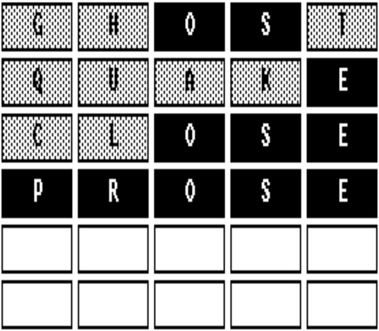
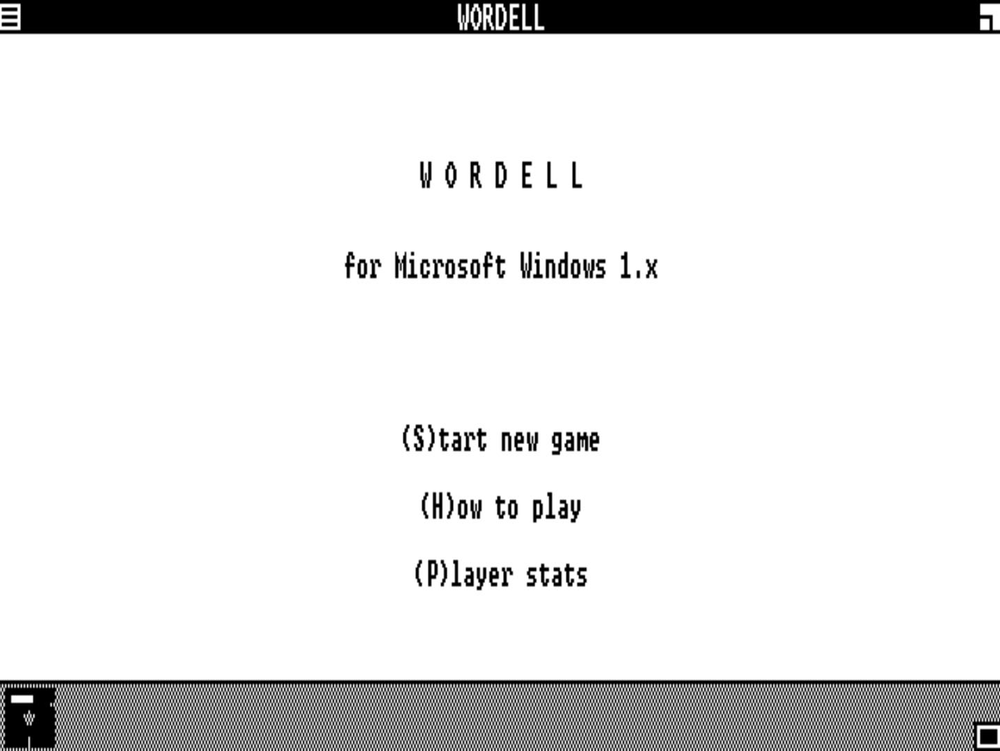
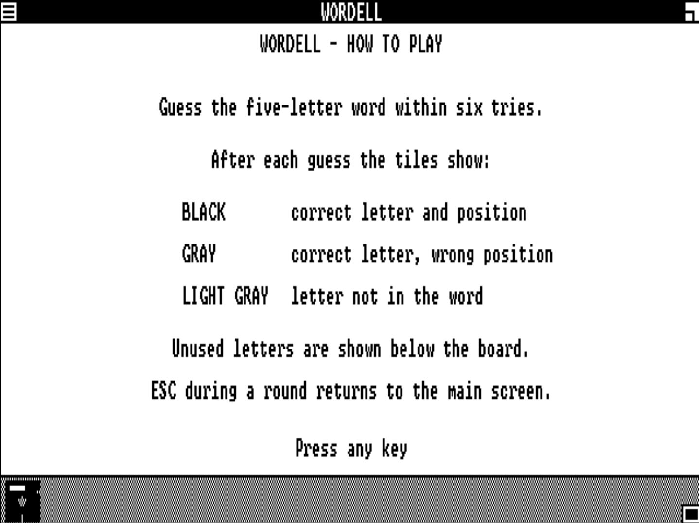
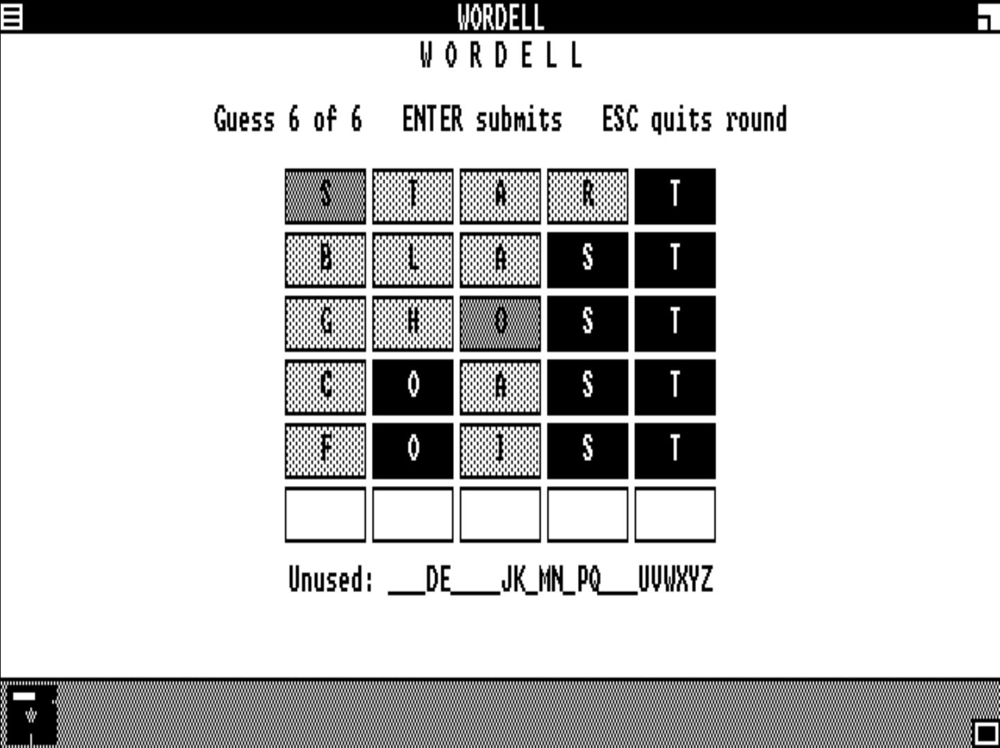
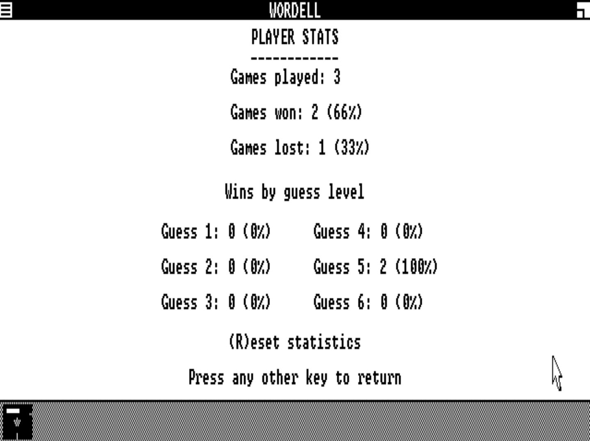
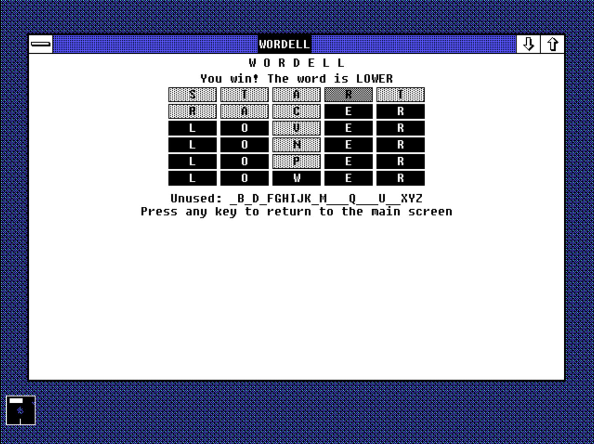
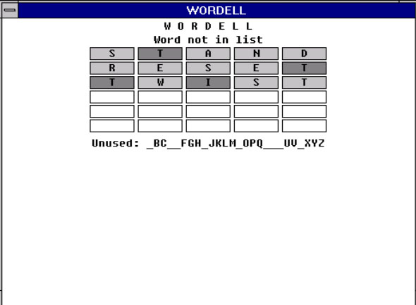
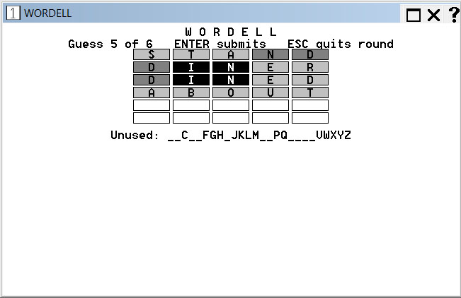

## Wordell: A Wordle Clone for Windows 1.0

Wordell is a Wordle clone for Windows 1.0 written in C. It features
2,315 possible unique games.

I don't know if there are any Windows 1.0 enthusiasts out there, but if
you are, this could be your jam. Mouse is available but isn't used.
It's basically a wrapper around the DOS 3.3 version, and the changes
are solely visual. It's also the exact same game code from the
[Apple II version](https://github.com/mpower-codeworks/WORDELL-Wordle-Clone-for-Apple-II).

### Why man, _why_?

I guess I just wanted to have an excuse to do some actual work in Windows 1.0, and since the
DOS version went swimmingly it seemed like I should have a go. Windows 1.0 is pretty cool.
I found that Windows 1.0 is  really best thought of as a hybrid system, because half the 
time you'll want to jump back into DOS to get things done.

I did most of the development on a modern PC; doing it all in Windows 1.0 would be torture.
However, a fair amount was indeed done on 1.0 because it was necessary. I already had the
game itself from the DOS version, and I used the "Hello" example from the Windows
SDK 1.0.3 as the template (from Disk 6 of the SDK). Edlin was used very often, and any
time is a good time for Edlin. Right?

## How Wordell for Windows 1.0 Works

The Windows 1.0 version of Wordell was built by using the original HELLO SDK sample
as the framework, and then the existing DOS Wordell code runs inside it. HELLO provides the
startup, message loop, window procedure, resources, et al. Thanks to whomever made those
samples - they're great. 

- Built with Microsoft C 4.0 and the Windows 1.03 SDK
- DOS-style screen output was replaced with Windows GDI
- Keyboard input is handled via Windows messages
- Screen updates are handled with WM_PAINT and InvalidateRect
- Windows resources provide the application name, icon, About dialog

## Screenshots

<table>
    <tr>
        <td align="left" width="50%" valign="middle">
             
        </td>
        <td align="left" width="50%" valign="middle">
             
        </td>
    </tr>
    <tr>
        <td align="left" width="50%" valign="middle">
             
        </td>
        <td align="left" width="50%" valign="middle">
             
        </td>
    </tr>
</table>

### Wait, can it run on other versions of Windows?

It can. It's fine on Windows 2.0, though sizing is wrong because of the resolution. Also, I
think Windows 2.0 has more to offer color-wise and maybe some other things. It also runs on
Windows 3.1 (I didn't try 3.0), however there is a compatibility warning. Each of these
deserves a target-specific version using all the bells and ribbons.

<table>
    <tr>
        <td align="left" width="50%" valign="middle">
             
            Windows 1.0 version on Windows 2.0
        </td>
        <td align="left" width="50%" valign="middle" rowspan="2">
             
            Windows 1.0 version on Windows 3.1
        </td>
    </tr>
    <tr>
        <td align="left" width="50%" valign="middle">
             
            Windows 3.1 compatibility warning
        </td>
    </tr>
</table>

## What about using Winevdm?

Why yes, yes you can. [Winevdm](https://github.com/otya128/winevdm) is a fantastic tool that
runs 16-bit applications on modern 64-bit systems. Wordell for Windows 1.0 is no exception.
As noted above, other versions it really should be made target-specific. But if you love Wordell
for Windows 1.0 and can't get enough if it (I can't) then Winevdm works great. I have to admit
I never know what to call it. WineVDM? Otvdm? Otvdmw? It's one of the Mysteries of the Universe.
Here's a photo of Wordell (WIndows 1.0) running on 11.

